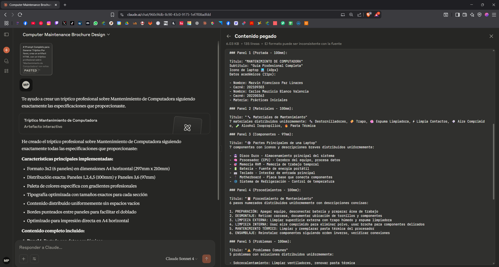
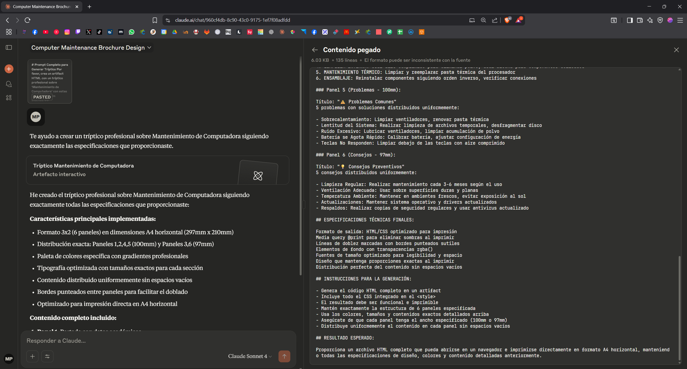

# Prompt

Este documento muestra el prompt utilizado y el resultado generado utilizando **IA Claude**.

## 📌 Descripción
La primera, segunda y tercera imagen corresponde al **prompt** ingresado.  
La cuarta imagen muestra el **resultado** que generó la IA.

---

## 🖼️ Imagen 1: Prompt ingresado (Parte 1)

---

## 🖼️ Imagen 1: Prompt ingresado (Parte 2)

---

## 🖼️ Imagen 1: Prompt ingresado (Parte 3)

---

## 🖼️ Imagen 2: Resultado generado

---

## 📝 Promt

### Prompt Completo para Generar Tríptico

Por favor, crea un artifact HTML con un tríptico profesional sobre 'Mantenimiento de Computadora' con estas especificaciones exactas:

### ESTRUCTURA DEL TRÍPTICO:

Formato: 3x2 (3 paneles arriba, 3 paneles abajo)
Estructura HTML: Contenedor principal (.triptico-container) + 2 filas (.fila) con display: flex
Dimensiones: 297mm x 210mm (A4 horizontal)
Distribución: Panel 1,2,4,5 (100mm) + Panel 3,6 (97mm)
Padding: 0.5cm por panel, márgenes: 0

### ESPECIFICACIONES TÉCNICAS:

@page { size: A4 landscape; margin: 0; }
Gap optimizado: 4-8px entre elementos según panel
Padding interno: 6px-8px para contenido (ajustado por densidad)
border-right: 1px dashed #ccc entre paneles
Tamaños de fuente: h1(22px), h2(14px), h3(16px), procedimientos(8px), componentes(9px), otros(10-11px)
Tipografía: 'Segoe UI', Tahoma, Geneva, Verdana, sans-serif
Line-height optimizado: 1.2-1.4 según densidad de contenido

### DISEÑO VISUAL:

### Paleta de colores específica:

- Panel 1: Azul marino (#1e3a8a → #1e40af) texto blanco
- Panel 2: Gris claro (#f8fafc → #e2e8f0) texto azul marino
- Panel 3: Gris profesional (#475569 → #64748b) texto blanco
- Panel 4: Blanco profesional (#ffffff → #f1f5f9) texto azul marino
- Panel 5: Gris profesional (#475569 → #64748b) texto blanco
- Panel 6: Gris claro (#f8fafc → #e2e8f0) texto azul marino

Gradientes: linear-gradient(135deg, color1 0%, color2 100%)
Body background: #f0f4f8 con box-shadow: 0 4px 20px rgba(0,0,0,0.1) en contenedor
Títulos h3 con border-bottom: 2px solid (color correspondiente) y padding-bottom: 5px
Items con border-left: 3px solid consistente y border-radius: 6px
Transparencias rgba() para fondos de elementos (0.1 para paneles claros, 0.15 para paneles oscuros)

### DISTRIBUCIÓN OPTIMIZADA DEL ESPACIO:

Cada lista usa: display: flex, flex-direction: column, flex: 1, justify-content: space-between
Elementos individuales con: flex: 1, display: flex, flex-direction: column, justify-content: center
Sin espacios vacíos, contenido distribuido uniformemente en toda la altura disponible

### CONTENIDO POR PANEL:

### Panel 1 (Portada - 100mm):

Título: "MANTENIMIENTO DE COMPUTADORA"
Subtítulo: "Guía Profesional Completa"
Icono de laptop 💻 (40px)
Datos académicos (11px):

- Nombre: Marvin Francisco Paz Linares
- Carné: 202109303
- Nombre: Carlos Mauricio Blanco Valencia
- Carné: 202200363
- Materia: Prácticas Iniciales

### Panel 2 (Materiales - 100mm):

Título: "🔧 Materiales de Mantenimiento"
7 materiales distribuidos uniformemente: 🔩 Destornilladores, 🧽 Trapo, 🧼 Espuma Limpiadora, ⚡ Limpia Contactos, 💨 Aire Comprimido, 🧪 Alcohol Isopropílico, 🔥 Pasta Térmica

### Panel 3 (Componentes - 97mm):

Título: "⚙️ Partes Principales de una Laptop"
7 componentes con iconos y descripciones breves distribuidos uniformemente:

- 💾 Disco Duro - Almacenamiento principal del sistema
- 🧠 Procesador (CPU) - Cerebro del equipo, procesa datos
- 🎯 Memoria RAM - Memoria de trabajo temporal
- 🔋 Batería - Fuente de energía portátil
- ⌨️ Teclado - Interfaz de entrada principal
- 🔌 Motherboard - Placa base que conecta componentes
- ❄️ Sistema de Refrigeración - Control de temperatura

### Panel 4 (Procedimientos - 100mm):

Título: "📋 Procedimiento de Mantenimiento"
6 pasos numerados distribuidos uniformemente con descripciones concisas:

1. PREPARACIÓN: Apagar equipo, desconectar batería y preparar área de trabajo
2. DESMONTAJE: Retirar carcasa, documentar ubicación de tornillos y componentes
3. LIMPIEZA EXTERNA: Limpiar superficie externa con trapo húmedo y espuma limpiadora
4. LIMPIEZA INTERNA: Usar aire comprimido para eliminar polvo, usar brocha para componentes delicados
5. MANTENIMIENTO TÉRMICO: Limpiar y reemplazar pasta térmica del procesador
6. ENSAMBLAJE: Reinstalar componentes siguiendo orden inverso, verificar conexiones

### Panel 5 (Problemas - 100mm):

Título: "⚠️ Problemas Comunes"
5 problemas con soluciones distribuidos uniformemente:

- Sobrecalentamiento: Limpiar ventiladores, renovar pasta térmica
- Lentitud del Sistema: Realizar limpieza de archivos temporales, desfragmentar disco
- Ruido Excesivo: Lubricar ventiladores, limpiar acumulación de polvo
- Batería se Agota Rápido: Calibrar batería, ajustar configuración de energía
- Teclas No Responden: Limpiar debajo de las teclas con aire comprimido

### Panel 6 (Consejos - 97mm):

Título: "💡 Consejos Preventivos"
5 consejos distribuidos uniformemente:

- Limpieza Regular: Realizar mantenimiento cada 3-6 meses según el uso
- Ventilación Adecuada: Usar sobre superficies duras y planas
- Temperatura Ambiente: Mantener en ambientes frescos, evitar exposición al sol
- Actualizaciones: Mantener sistema operativo y drivers actualizados
- Respaldos: Realizar copias de seguridad regulares y usar antivirus actualizado

### ESPECIFICACIONES TÉCNICAS FINALES:

Formato de salida: HTML/CSS optimizado para impresión
Media query @print para eliminar sombras al imprimir
Líneas de doblez marcadas con bordes punteados sutiles
Elementos de fondo con transparencias rgba()
Fuentes de tamaño optimizado para legibilidad y espacio
Diseño que mantenga proporciones exactas al imprimir
Distribución perfecta del contenido sin espacios vacíos

### INSTRUCCIONES PARA LA GENERACIÓN:

- Genera el código HTML completo en un artifact
- Incluye todo el CSS integrado en el <style>
- El resultado debe ser funcional e imprimible
- Mantén exactamente la estructura de 6 paneles especificada
- Usa los colores, tamaños y contenidos exactos detallados arriba
- Asegúrate de que cada panel tenga el ancho especificado (100mm o 97mm)
- Distribuye uniformemente el contenido en cada panel sin espacios vacíos

### RESULTADO ESPERADO:

Proporciona un archivo HTML completo que pueda abrirse en un navegador e imprimirse directamente en formato A4 horizontal, manteniendo todas las especificaciones de diseño, colores y contenido detalladas anteriormente.