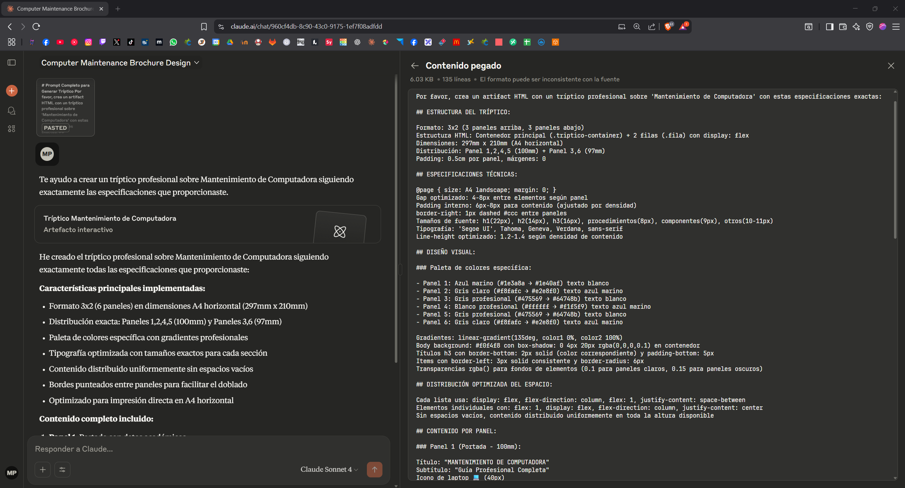

# Prompt

Este documento muestra el prompt utilizado y el resultado generado utilizando **IA Claude**.

## 📌 Descripción
La primera imagen corresponde al **prompt** ingresado.  
La segunda imagen muestra el **resultado** que generó la IA.

---

## 🖼️ Imagen 1: Prompt ingresado

---

## 🖼️ Imagen 2: Resultado generado

